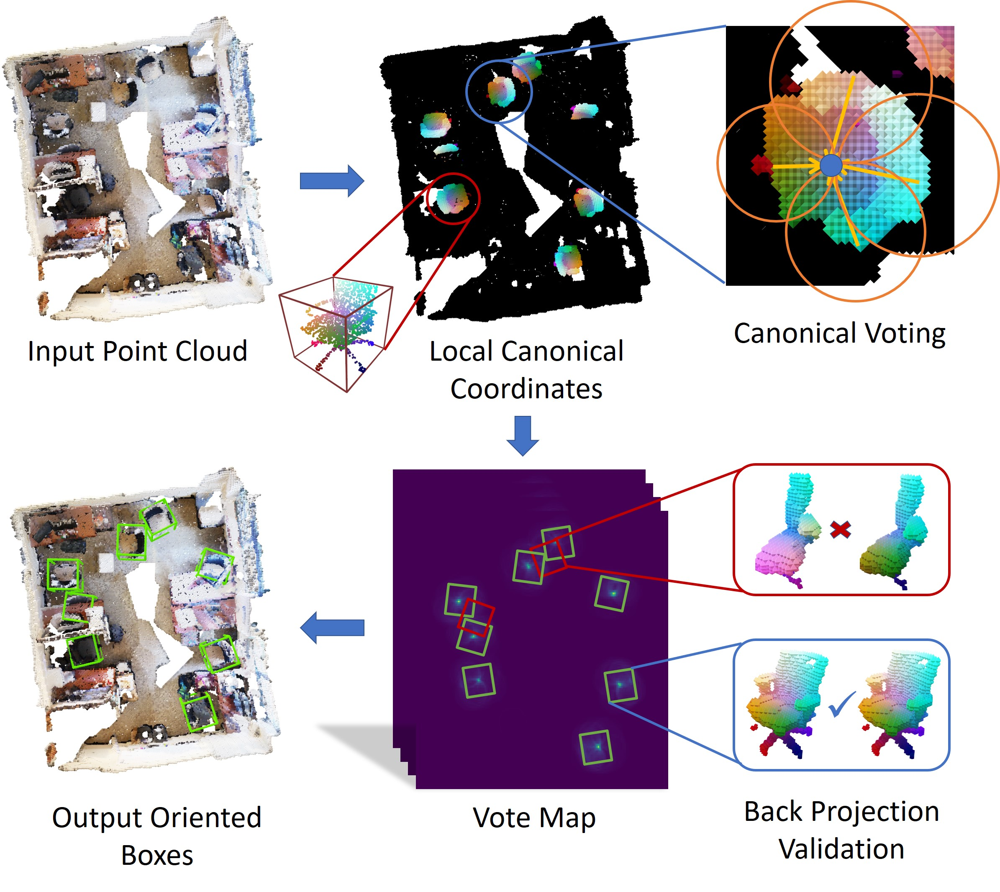

<h1 align="center">
Canonical Voting: Towards Robust Oriented Bounding Box Detection in 3D Scenes
</h1>

<p align='center'>
 </img>
</p>

<div align="center">
<h3>
<a href="https://qq456cvb.github.io">Yang You</a>, Zelin Ye, Yujing Lou, Chengkun Li, Yong-Lu Li, Lizhuang Ma, Weiming Wang, Cewu Lu
<br>
<br>
CVPR 2022
<br>
<br>
<a href='https://arxiv.org/pdf/2011.12001.pdf'>
  
</a>
<a href='https://qq456cvb.github.io/projects/canonical-voting'>
  
</a>
<a href='https://youtu.be/W7ZYEES5cLY'>

</a>
<br>
</h3>
</div>

Canonical Voting is a 3D detection method that disentangles Hough voting targets into Local Canonical Coordinates (LCC), box scales and box orientations. LCC and box scales are regressed for each point while box orientations are generated by a canonical voting scheme. Finally, a LCC-aware back-projection checking algorithm iteratively cuts out bounding boxes from the generated vote maps, with the elimination of false positives. Our model achieves state-of-the-art performance on challenging large-scale datasets of real point cloud scans: ScanNet, SceneNN and SUN RGB-D.

# News
- **[2022.03]** Our voting-based category-level 9D pose estimation method [CPPF](https://github.com/qq456cvb/CPPF), which achieves decent sim-to-real performance, is accepted to CVPR 2022!

# Change Logs
- [2022.04.11] Upload `Bathtub` fixed Scan2CAD annotations.
- [2022.04.11] Update install dependencies to more recent versions.
- [2022.04.22] Fix a bug in evaluating joint models.
# Contents
- [Overview](#overview)
- [Installation](#installation)
- [Train and Test on ScanNet](#train-and-test-on-scannet)
- [Test on SceneNN](#test-on-scenenn)
- [Train and Test on SUN RGB-D](#train-and-test-on-sun-rgb-d)
- [Pretrained Models](#pretrained-models)
- [Citation](#citation)

# Overview
This is the official Pytorch implementation of our work: Canonical Voting.
# Installation
- [MinkowskiEngine](https://github.com/NVIDIA/MinkowskiEngine) v0.5.3
- Install our custom Hough Voting module under `houghvoting` folder, by running `python setup.py install`
- Tested with PyTorch v1.8.1 + CUDA 10.2
- Other dependecies: 
```
pip install hydra-core==1.1.1 scipy scikit-learn tqdm shapely numpy-quaternion==2021.8.30.10.33.11 pickle plyfile
```

# Train and Test on ScanNet
<details>
<summary>Data Preparation</summary>

You will need to first download the original [ScanNet](https://github.com/ScanNet/ScanNet) dataset. For [Scan2CAD](https://github.com/skanti/Scan2CAD) labels with oriented bounding boxes, we removed some ambiguous Scan2CAD annotations for `Bathtub` (wordnet id: 02808440) category, including washbasins, washstands, etc. You can download our `Bathtub` fixed annotations on [Google Drive](https://drive.google.com/file/d/1-D4gvCcSIXKZGGmi1lHv91fqKq46sYJn/view?usp=sharing).

Download our annotated Scan2CAD model segments [here](https://drive.google.com/drive/folders/1yKIcQuJte9vToRLbZYgwdYqUDECBYs1T?usp=sharing) and preprocessed ground-truth boxes [here](https://drive.google.com/drive/folders/1i4ctu3oxwYG19kczqNgryj5uMnZVQZCv?usp=sharing) for evaluation. Adjust their path accordingly in `config/config.yaml`.
</details>

<details>
<summary>Start Training</summary>

To train model jointly for all categories, with one unified model:
```
python train_joint.py
```
To train model separately for each category:
```
python train_separate.py category=03211117,04379243,02808440,02747177,04256520,03001627,02933112,02871439,others -m
```
</details>

<details>
<summary>Evaluate mAP</summary>

Once trained, you can evaluate the model's mAP on ScanNet val set.

To eval the jointly trained model:
```
python eval_joint.py
```
To eval the separately trained model:
```
python eval_separate.py
```
</details>

# Test on SceneNN
<details>
<summary>Data Preparation</summary>

You will need to download our processed [SceneNN](https://mega.nz/folder/n7hzDQxb#mV8t4d7psPYN5bSkkxHuYw) data, which contains raw segmentation labels, instance labels and bounding box annotations. Set `scene_nn_root` in `config.yaml` to your downloaded directory.
</details>

<details>
<summary>Evaluate mAP</summary>

Run `eval_joint.py` or `eval_separate.py` with modified variable `SCENENN=True`.
</details>

# Train and Test on SUN RGB-D
We are still organizing this part of code. For a brief guidance on reproducing results,
we follow [BRNet](https://github.com/cheng052/BRNet) to prepare data for training and testing, while separately train a ``learned`` FPS proposal sampler as described in the paper.
We modify L190 in `mmdet3d/models/dense_heads/vote_head.py` to take specific center point locations that are sampled from the learned voting-based proposal sampler. The probability is proportional to the square root of the vote map values, which is implemented by `torch.multinomial`. The hyper-parameter settings are exactly the same as those used in BRNet.

# Pretrained Models
<details>
<summary>Pretrained Model on ScanNet</summary>

Pretrained models for both joint and separate training settings can be found [here](https://drive.google.com/drive/folders/1Af5mRVwwI370txOREXkooea8nK_SwzGk?usp=sharing). You will get about 15.4 mAP and 21.7 mAP for joint and separate training settings, respectively.
</details>

<details>
<summary>Pretrained Model on SUN RGB-D</summary>
Coming soon.
</details>

# Citation
If you find our algorithm useful or use our processed data, please consider citing:
```
@article{you2022canonical,
  title={Canonical Voting: Towards Robust Oriented Bounding Box Detection in 3D Scenes},
  author={You, Yang and Ye, Zelin and Lou, Yujing and Li, Chengkun and Li, Yong-Lu and Ma, Lizhuang and Wang, Weiming and Lu, Cewu},
  journal={Proceedings of the IEEE/CVF Conference on Computer Vision and Pattern Recognition},
  year={2022}
}
```
